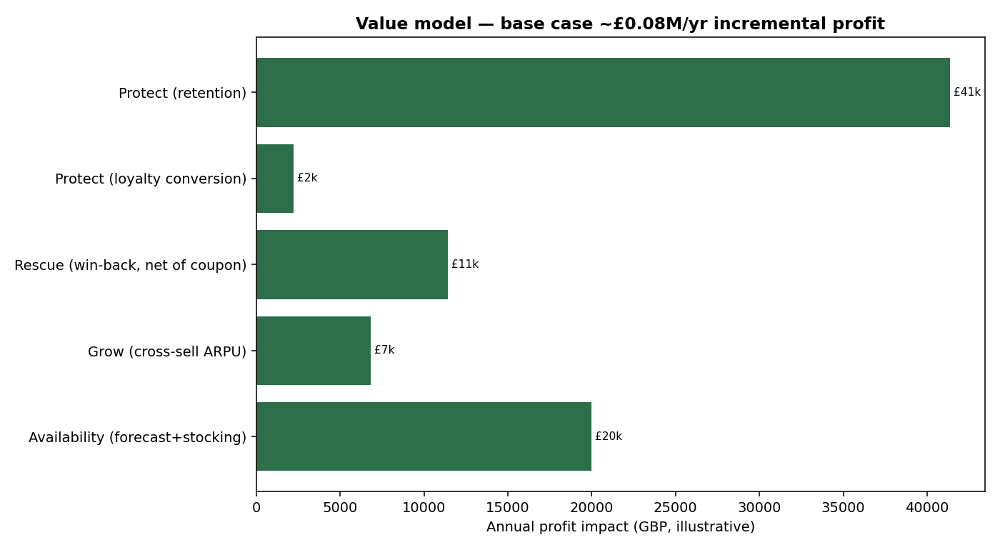
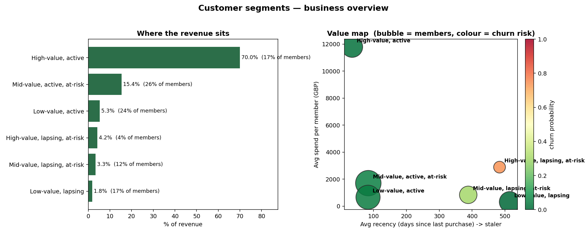

# Retail Customer-Intelligence — What I Deliver
### A Chief Data Officer's view: from transaction data to proven profit

I help retailers and e-commerce businesses turn raw transaction data into a **customer &
demand intelligence capability** that grows margin — and I prove every play with a
controlled experiment before you scale spend. Real client data is confidential, so this is an end-to-end reference build on a **public**
retail dataset as a stand-in; the *methods and outcomes* are exactly what I
deliver on your data.

## The outcome

A single capability that answers the three questions that move profit — **who your
customers are, who is leaving, and what to offer them** — plus demand forecasting that
sets profit-optimal stock, all priced in money and ranked for investment.

*Illustrative on the proxy: ~£82k/yr ≈ **+2.4% of profit** here, scaling to **~£8M/yr at £1B revenue** (the addressable prize is larger still). Retention is the biggest lever; the percentages scale
linearly with your revenue. Assumptions are explicit and sensitivity-tested.*

## Before → after

| Capability | Before | After |
|---|---|---|
| Customer understanding | one-size-fits-all | segments prioritised by profit |
| Churn | found after they leave | scored early (AUC ≈ 0.79) → rescue list |
| Marketing spend | blanket, gut-led | profit-thresholded + proven by control group |
| Cross-sell | generic | personalised next-best product |
| Inventory | reactive | forecast + margin-aware stocking |
| Guest revenue | invisible | sized & converted via loyalty |

## How I work

- **Business leads, technology serves** — every model maps to a profit decision.
- **Money on the metrics** — results in currency, not just model scores.
- **Proven, not promised** — controlled experiments (holdout groups) before scaling.
- **Candid about limits** — assumptions stated; simple baselines respected; I recommend a
  hybrid over a trophy model when the simple thing wins.
- **Reproducible** — a clean warehouse, documented models, and an executive narrative.

## What you can engage me for

Customer segmentation · churn early-warning · cross-sell / recommendation engines ·
demand forecasting & inventory optimisation · a £/฿ value model to prioritise spend ·
and the executive story your leadership will act on.

**Full methodology & code:** `README.md` · **Executive deck:** `Retailer-CDO-Solution-Deck.pptx`

*Let's talk about your data → profit roadmap.*
