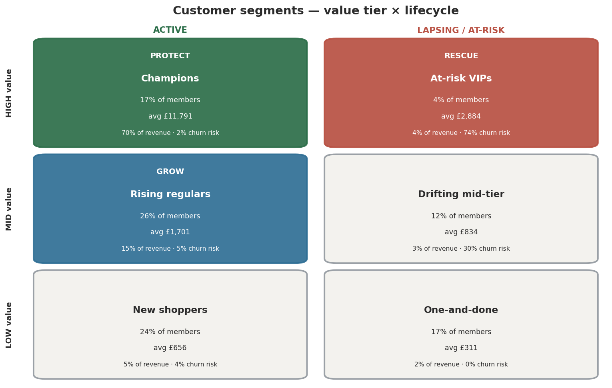
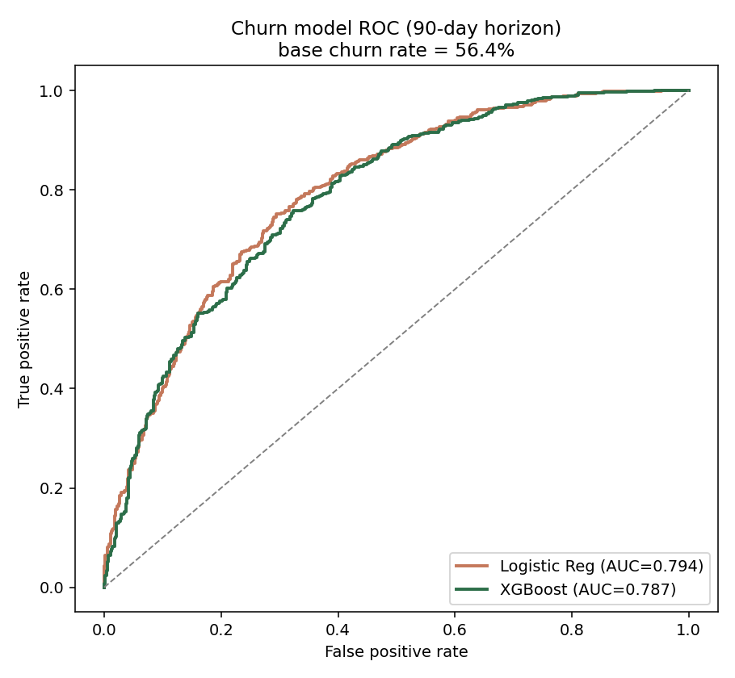
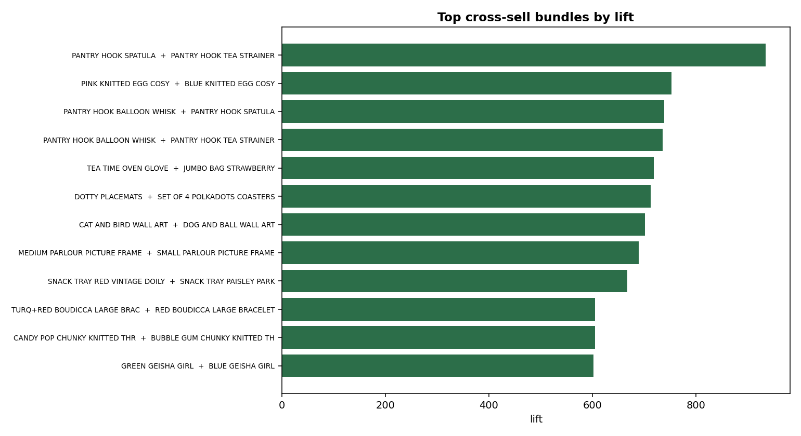
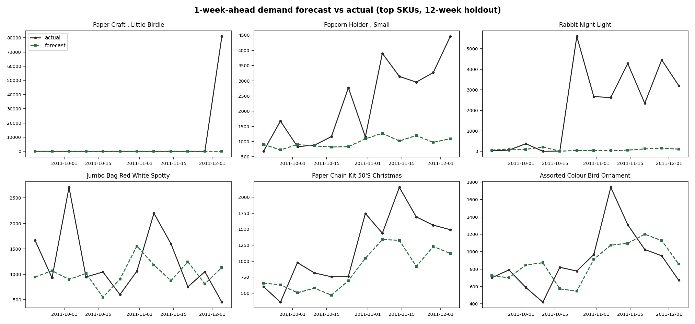
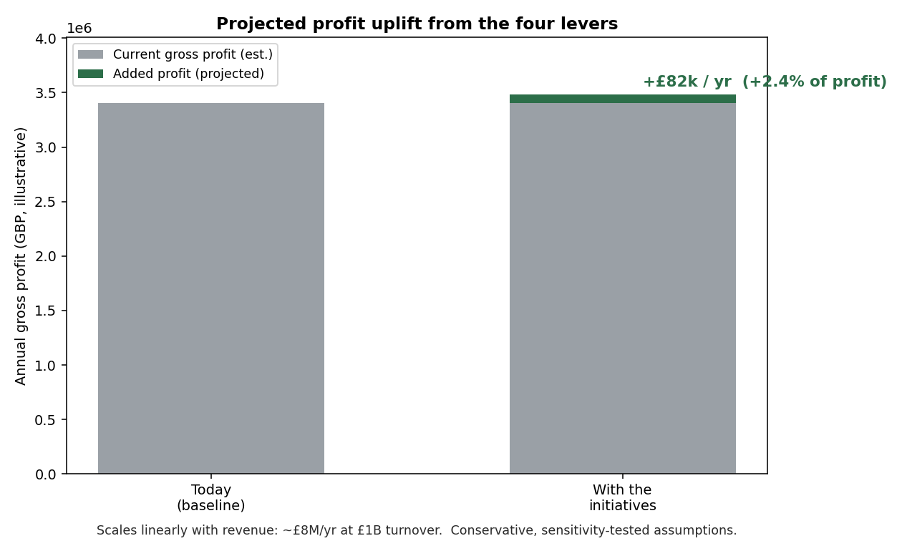

# Retail Customer & Demand Intelligence
*An end-to-end analytics case study — from raw sales records to a board-ready growth plan.*

**The principle throughout: business leads, the technical work serves it.** Every model
exists to answer a business question and is reported in money, not jargon.

---

## The problem & the objective

**The problem.** Retail runs on thin margins, and most retailers sit on millions of
transactions while still operating half-blind: every shopper is treated the same, customers
quietly leave before anyone notices, promotions are fired at everyone (discounting people
who'd have bought anyway), stock is set by gut, and a chunk of revenue comes from shoppers
the business can't even identify.

**The objective.** Use the transaction history to **grow gross-margin profit** by doing
four things well — *know* our customers, *keep* the valuable ones, *grow* the rest, and
*stock the right products* — and to put a money value on each opportunity so leadership
knows where to invest first. Every recommendation is paired with a way to **prove it worked**
before spending at scale.

> *Why public data, and not a real company's? In short — **confidentiality** (full note in the
> Appendix at the end of this README).*

---

## What the analysis delivered

- **A clear picture of the customer base:** just **17% of members generate 70% of revenue**.
  Customers fall into six behaviour-based groups; we prioritise three — **Protect, Rescue, Grow**.
- **An early-warning system for customer loss** that flags who's about to stop buying *before*
  they go — surfacing a **250-customer, ~£0.7M rescue list**.
- **A "what to buy next" engine** that beats guesswork by ~100×.
- **A demand forecast that becomes a stocking decision**, tuned to protect availability.
- **A money value on every lever:** ≈ **£82k/year** of extra profit here (**+2.4% of profit**),
  scaling to ~**£8M/yr at £1B revenue**, with **retention the single biggest lever**.

---

## How it was done

Raw sales records → audited cleaning → a tidy data warehouse → four analyses (who our
customers are, who's leaving, what to offer, how much to stock) → a money-value model →
an executive recommendation. Implementation is in [`src/`](src); the story is narrated in
[`notebooks/`](notebooks).

**Techniques & skills demonstrated:** data cleaning & QA · data warehousing (star schema) ·
**feature engineering** · **unsupervised learning** (customer segmentation / clustering) ·
**supervised machine learning** (churn classification, demand forecasting) · **collaborative
filtering** (recommendations) · **A/B test design & hypothesis testing** · **applied
GenAI / LLM** (product categorisation) · profit & value modelling.

---

## 1 · Getting the data right

Real-world sales data is messy. We cleaned **1.07M records down to 1.01M** (94% kept),
removing duplicates, returns/cancellations and non-sale adjustments, and separating genuine
products from service lines (postage, fees). The process is shown step-by-step so it can be
trusted ([`docs/cleaning_showcase.md`](docs/cleaning_showcase.md)).

A key decision: **shoppers who didn't identify themselves ("guests") are kept and labelled,
not discarded** — they're real demand and a prime target to convert into tracked members
(**13% of revenue, in unusually large baskets**). The data was organised into a
query-friendly **star-schema warehouse** (a central sales table linked to customer, product,
category and date tables — [`docs/star_schema.md`](docs/star_schema.md)). The products had no
category labels, so we used an **AI language model to auto-classify every product** into a
12-category structure.

---

## 2 · Who are our customers? (Segmentation)

We grouped customers by **how recently, how often and how much they buy, how long they've
shopped with us, and how likely they are to stay** (an industry method called *RFMTC*), then
let the data find natural groupings (*K-Means clustering*). We chose **six groups** — more
granular than the statistically "tidiest" answer, because a real marketing team can act on
finer groups.



| Segment | Size | Who they are (behaviour) | Avg spend | Risk of leaving | Share of revenue |
|---|---|---|---|---|---|
| **High-value, active** | 1,013 (17%) | The loyal core — buy often (~monthly), big, wide-ranging baskets | £11,791 | Very low (2%) | **70%** |
| **Mid-value, active, at-risk** | 1,545 (26%) | Engaged but only ~quarterly buyers; clear room to grow | £1,701 | Low (5%) | 15% |
| **Low-value, active** | 1,380 (24%) | Mostly **new** customers, early in their journey | £656 | Low (4%) | 5% |
| **High-value, lapsing, at-risk** | 250 (4%) | Used to buy every few weeks, now silent for a year — big spenders slipping away | £2,884 | **High (74%)** | 4% |
| **Mid-value, lapsing, at-risk** | 675 (12%) | Occasional buyers drifting away | £834 | Medium (30%) | 3% |
| **Low-value, lapsing** | 989 (17%) | One-time buyers, long gone | £311 | — | 2% |

The groups differ by **how much and how often they buy — not by *what* they buy** (every
group buys a similar product mix), so the levers are loyalty, frequency and win-back. The
three we prioritise, each with a distinct job:

- **Protect — High-value, active.** 70% of revenue. *Keep them* with loyalty rewards, early
  access, premium service and a concierge tier for the very top — **not** broad discounts
  (they'd buy anyway). A small drop here is the biggest possible loss.
- **Rescue — High-value, lapsing.** Only 250 people but ~£2,884 each and ~£0.7M slipping
  away. A one-time, personalised win-back, targeted by the early-warning model and **tested
  against a control group** so we know it actually worked.
- **Grow — Mid-value, active.** 1,545 engaged customers with headroom. Cross-sell and gentle
  frequency nudges — targeted only where it's profitable.

---

## 3 · Who's leaving? (Retention & early warning)

**Where customers leak:** only ~20% of new customers come back the next month — the drop-off
is at the **second purchase**, so the highest-value fix is better onboarding, not a loyalty
tier (cohort analysis). *(The retention curve is an average; it isn't strictly monotonic — a few
early cohorts tick back up around month 11–12 as seasonal Christmas buyers reactivate, which is
expected in seasonal retail rather than an error.)*

**Early-warning model:** we flag who is likely to stop buying in the next 3 months, using
only information available at decision time (a careful time-split so the model never "peeks"
at the future). It ranks at-risk customers well — **AUC = 0.79**. The strongest warning signs
are intuitive: **how long since the last purchase, versus that customer's normal rhythm.**
Honest note: a simple model did about as well as the fancier one — the signal is mostly
straightforward, and we say so.

> *Remark — what is AUC? "Area Under the Curve" measures how well a model **ranks** risk: it's
> the chance the model scores a real leaver higher than a non-leaver. 0.5 = guessing, 1.0 =
> perfect. **0.79 ≈ right about 4 times out of 5.***



**Proving the win-back works:** the rescue campaign is designed as a controlled experiment —
some customers get the offer, a held-out group gets nothing — so we measure the *true* lift.
The group is small (250), so the test detects only a sizeable effect; we're upfront about
that ([`docs/experiment_design.md`](docs/experiment_design.md)).

---

## 4 · What should each customer buy next? (Cross-sell)

We built a recommendation engine from "customers who bought this also bought that" patterns
(*item-based collaborative filtering*). In testing it placed the right product in its **top-10
suggestions about 1 in 4 times — roughly 100× better than random** (*hit-rate@10 = 24.6%*).
It also flags **slow-moving stock** and pairs it with a popular partner product to clear
inventory. This powers the Grow play's "next best product."



---

## 5 · How much should we stock? (Demand forecasting)

We forecast next week's demand for the top 100 products and turn it into a **profit-aware
order quantity** — deliberately stocking a little above the forecast so we don't lose sales
when margins are healthy (a classic *newsvendor* calculation).



We report error in two ways, both in **real units** (not percentages that break on
zero-demand weeks):

- **Typical miss (MAE): ~220 units per product per week** — uses absolute values, so over- and
  under-shoots don't cancel out.
- **Bias (net direction): the model *under-forecasts* by ~126 units per product-week.**
  This matters: left uncorrected, a model that leans low causes **stock-outs and lost sales**.
  It's the buffer the **purchasing team adds back** when ordering — and the profit-aware
  stocking rule builds it in automatically.

An honest, senior finding: a **simple 4-week average is a strong benchmark** and beats the
machine-learning model on the overall number — but the model (*XGBoost*) wins on **61% of
individual products**. So the right answer is a **blend** (model for most products, simple
average for the few volatile big-sellers), not forcing the fancy model to win.

> *Remark — why not sum-of-squared-error? Its units are "units squared", which means nothing
> to a buyer; its interpretable form is RMSE. We report **MAE** (typical size of miss) plus
> **bias** (systematic direction) because together they're exactly what an ordering decision
> needs.*

---

## 6 · What is it worth? (Value model)

Each opportunity, translated into estimated **annual profit** using real revenue and
clearly-stated, stress-tested assumptions:



| Opportunity | Estimated annual profit |
|---|---|
| **Protect — retain the high-value core** | **£41k** |
| Stock smarter (forecasting) | £20k |
| Rescue — win back lapsing big spenders | £11k |
| Grow — cross-sell to the mid-tier | £7k |
| Convert anonymous "guest" shoppers via loyalty | £2k |
| **Total (base case)** | **≈ £82k / year** |

> **Campaign view (more tangible than the blended total):** a single 250-person **Rescue**
> campaign is expected to win back **~30 high-value customers** (vs an untreated control),
> recovering **~£43k revenue / ~£15k margin**, **net ~£11k after coupon costs — about a 3×
> return**. *(Expected and illustrative; the control group confirms the true lift.)*

Why this is compelling despite the modest absolute figure: it's **+2.4% of profit** on a tiny
(~£10M/yr) dataset, it **scales linearly** (~**£8M/yr at £1B revenue**), and the *addressable
prize is larger still* — ~£0.7M of revenue actively at-risk plus **£2.57M of untracked guest
revenue** to convert. **Retention is the biggest single lever.** Ranges: £41k–£123k (campaign
performance), £57k–£106k (margin assumptions). Details: [`docs/value_model.md`](docs/value_model.md).

---

## Honest notes (stated, not hidden)

Public stand-in data (methods transfer, the specific product mix doesn't); profit figures rest
on an assumed margin because public data lacks costs; "lost sales" can't be observed directly,
so the stocking value is the most assumption-heavy; the rescue group is small, so its
experiment is read directionally; and a simple model beat the complex one on forecasting, so we
recommend a blend. Adapting to a Thai retailer would add local seasonality (payday cycles,
Chinese New Year, the Vegetarian Festival) — see [`docs/scaling-to-production.md`](docs/scaling-to-production.md).

---

## Repository, deliverables & how to run

```
src/        cleaning · features · segmentation · churn · cross-sell · forecasting · value · warehouse
notebooks/  01–06 narrative walkthroughs (plain-language headings + charts, calling src/)
docs/       cleaning showcase · star schema · segment deep-dive · experiment design · value model · scaling
reports/    figures (charts) + tables (results)
```

**Run:** `pip install -r requirements.txt`, place `online_retail_II.xlsx` in `data/raw/`, then
`python -m src.pipeline.build_features` followed by the analysis modules.
**Tools:** Python, pandas, scikit-learn, XGBoost, lifetimes, matplotlib, a parquet star schema.

**Audience routing:** employers / data teams → this README + [`Retailer-DS-Technical-Presentation.pdf`](Retailer-DS-Technical-Presentation.pdf);
business leaders / clients → [`CDO-Portfolio.md`](CDO-Portfolio.md) + [`Retailer-CDO-Solution-Presentation.pdf`](Retailer-CDO-Solution-Presentation.pdf).
Executive write-up: `CDO-Executive-Report.md`.

---

## Appendix — data & method notes

**Why public data, not a company's real data?** Real retail transaction data is commercially
**confidential** and almost never shareable in a public portfolio. So this study uses the
public **UCI Online Retail II** dataset as an anonymised stand-in for a major retailer. The
*methods, reasoning and code are exactly what I apply to a client's real data* (under NDA);
only the dataset differs. Business mapping: a product = `StockCode`, a basket = `Invoice`, a
member = `Customer ID`. Money figures use an assumed profit margin (the public data has prices
but not costs) and are clearly flagged as illustrative.
