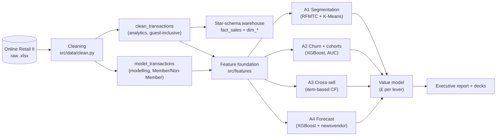

# Architecture

One repository that turns raw omnichannel transactions into business decisions, in five
layers. Business leads; every model maps to a profit decision.

**Layers:** (1) cleaning → two fit-for-purpose tables; (2) a star-schema warehouse and a
reusable feature foundation (with an LLM-built product-category dimension); (3) four ML
analyses; (4) a £-value model ranking the levers; (5) an executive report and two
audience-tailored decks. Productionisation (experiment tracking, containerised serving, a
GenAI "ask-the-data" assistant) is the documented roadmap — see
[`scaling-to-production.md`](scaling-to-production.md). Warehouse ER diagram:
[`star_schema.md`](star_schema.md).
