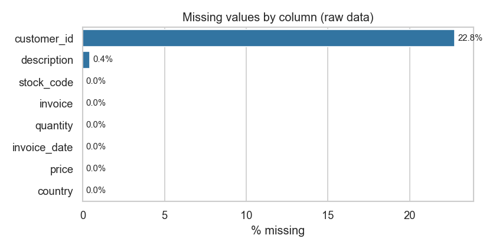
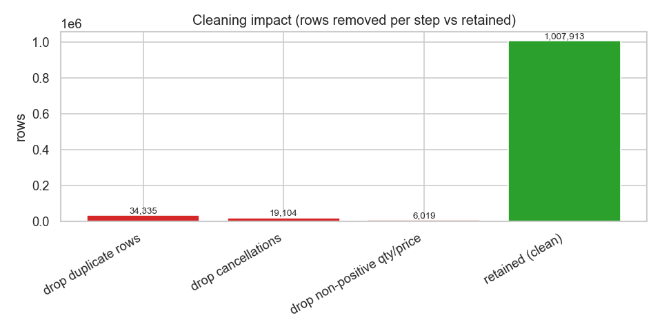

# Data Cleaning Report — Phase 1

Companion to [`notebooks/01_data_understanding_and_cleaning.ipynb`](../notebooks/01_data_understanding_and_cleaning.ipynb).
The cleaning logic is implemented once in [`src/data/clean.py`](../src/data/clean.py)
and reused everywhere, so this narrative and the production pipeline never drift.

**Source:** UCI Online Retail II (`online_retail_II.xlsx`), two sheets concatenated
= **1,067,371 raw rows × 8 columns**, spanning Dec 2009 – Dec 2011.

---

## 1. Are these columns needed?

All eight columns are retained — each maps to at least one analysis — so cleaning
removes *rows*, not columns. (On load we rename to snake_case.)

| Column | Verdict | Used for | Note |
|---|---|---|---|
| Invoice | Keep | Basket analysis, de-dup, cancellation flag | Leading `C` = cancellation → dropped |
| StockCode | Keep | Forecasting, basket, product master | Non-SKU service codes flagged, not sold |
| Description | Keep | Product label, product master | Some missing → filled from modal description per SKU |
| Quantity | Keep | Revenue, demand, inventory | Non-positive (returns/adjustments) dropped |
| InvoiceDate | Keep | Forecasting, recency, seasonality | Parsed to datetime |
| Price | Keep | Revenue, gross-margin model | Non-positive dropped |
| Customer ID | Keep | Segmentation, CLV, churn | Missing ~23% (guest baskets); needed only member-level |
| Country | Keep | Geography, segmentation | UK dominates |

## 2. Missing values

| Column | % missing | Treatment |
|---|---|---|
| Customer ID | ~23% | **Kept.** Guest/unidentified baskets — valid for sales, forecasting, basket analysis; excluded only from member-level work. |
| Description | <0.5% | Filled from the modal description per SKU when a label is needed. |
| All others | 0% | — |

## 3. Are these rows needed? — cleaning step by step

Each step in order, with rows removed (the dtype/flag/revenue steps transform or
add columns and remove zero rows — shown for transparency):

| Step | Rows removed | Rationale |
|---|---:|---|
| standardise dtypes | 0 | Trim text, parse dates, cast `customer_id` to Int64 |
| drop unparseable dates | 0 | All dates parsed cleanly |
| drop duplicate rows | **34,335** | Exact duplicate lines (known dataset artefact) |
| drop cancellations | **19,104** | `C`-invoices are returns, not sales |
| drop non-positive qty/price | **6,019** | Adjustments, freebies, bad-debt write-offs |
| flag product vs service | 0 | Flags **4,699** service/admin lines (POST, DOT, fees, ADJUST) |
| add line revenue | 0 | `revenue = quantity × price` |

**Result: 1,067,371 → 1,007,913 rows (94.4% retained).** Of the clean lines,
1,003,214 are genuine product lines and 4,699 are flagged service/admin lines
(excluded from product-level SKU and basket analysis, kept for total revenue).

## 4. Output

`python -m src.pipeline.build_features` writes the cleaned line-level table to
`data/processed/clean_transactions.parquet` (input to the Phase 2 star schema)
plus the three feature marts. Full column reference: [`data_dictionary.md`](data_dictionary.md).
