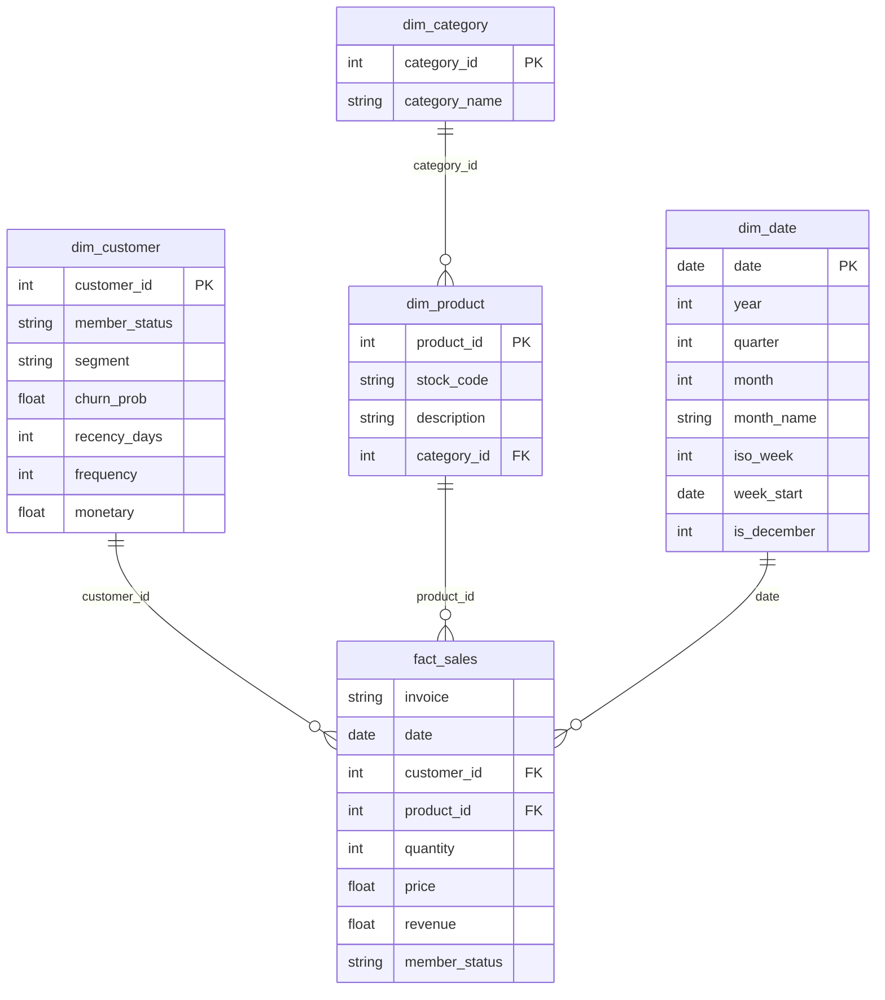

# Star-Schema Warehouse (Phase 2)

Fact table keyed by surrogate IDs (`product_id`, `category_id`) and natural
`customer_id`, with the **real date** as the date key. Dimension/master tables map IDs to
names and attributes. Materialised as parquet in `data/warehouse/` (loadable into DuckDB
or any warehouse).



**Grain:** one row per product line per invoice. **Conformed dimensions** are reused by
every analysis (segment lives on `dim_customer`, category on `dim_product → dim_category`).
`customer_id = 0` is the Non-Member member (guest baskets). Verified: fact reconciles to
£19.64M total revenue with zero unmapped products.

Example query (revenue by category by month):
```sql
SELECT d.year, d.month, c.category_name, SUM(f.revenue) AS revenue
FROM fact_sales f
JOIN dim_product  p ON f.product_id  = p.product_id
JOIN dim_category c ON p.category_id = c.category_id
JOIN dim_date     d ON f.date        = d.date
GROUP BY 1,2,3 ORDER BY 1,2,4 DESC;
```
